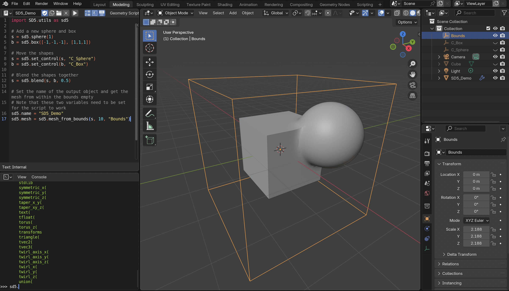

# SD5 Blender addon
SD5 is a Blender addon that adds the [libfive](https://libfive.com/) library to Blender.
This allows users to create constructive solid geometry from within Blender using Python scripts.



# How to use
Download the repository as a zip and install the addon in Blender.

Open Blender and go to the scripting tab and create a new script with a name starting with "SD5_". This is to allow the handler to automatically execute the script in the post depsgraph handler.

The quick way is to now put the following in the script:
```
import SD5.utils as sd5

s = sd5.sphere(2)
sd5.name = "SD5_Demo"
sd5.mesh = s.get_mesh()
```
Then click in the viewport to update the depsgraph and the handler wil run the script.

The better way would be to first add three empties to the scene.
I will call them "C_Sphere", "C_Box" and "Bounds".
Then put the following in the script:
```
import SD5.utils as sd5

# Add a new sphere and box
s = sd5.sphere(1)
b = sd5.box([-1,-1,-1], [1,1,1])

# Move the shapes
s = sd5.set_control(s, "C_Sphere")
b = sd5.set_control(b, "C_Box")

# Blend the shapes together
s = sd5.blend(s, b, 0.5)

# Set the name of the output object and get the mesh from within the bounds empty
# Note that these two variables need to be set for the script to work
sd5.name = "SD5_Demo"
sd5.mesh = sd5.mesh_from_bounds(s, 10, "Bounds")
```
If you move the empty the corresponding shape will update it's position, rotation and scale. For a better viewing experience set the shading on the object to auto smooth.

To see all available functions you can import the library like in the script in the Python console tab and use autocomplete to get a list of functions.

To see Python errors and print statements toggle the system console under the view tab on Windows or start Blender from the terminal on MacOS and Linux.